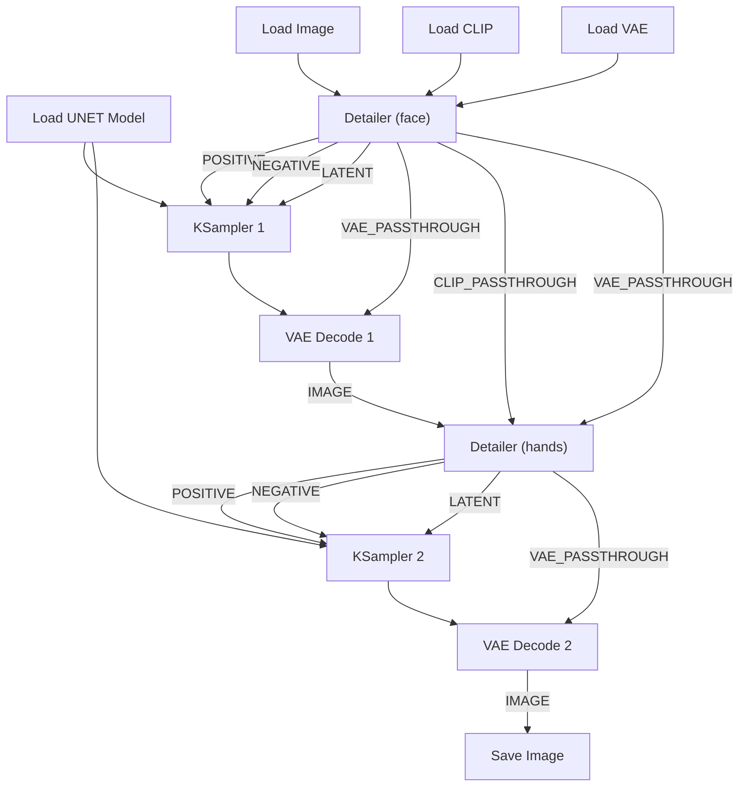

# ComfyUI HandFixer Suite

This project is a fork and significant expansion of the original [HandFixer](https://github.com/lllyasviel/handfixer) project, refactored into a single, powerful, ADetailer-style node for ComfyUI.

The goal of this suite is to provide a versatile, all-in-one solution for detecting, masking, and preparing targeted inpainting fixes for common AI generation flaws like hands, faces, and more, all powered by the lightweight and efficient MediaPipe library.

## Features

*   **All-in-One Detailer Node:** A single, powerful node that handles masking, prompting, and latent preparation for a targeted detail pass.
*   **"Batteries-Included" Detection:** No external YOLO models to download. All detectors are built into the `mediapipe` library.
*   **Versatile Targets:** Generate masks for `hands`, `faces`, `eyes`, `mouth`, `feet`, `pose`, and more with a simple dropdown.
*   **ADetailer-Style Filtering:** Sort and filter detected objects by confidence, size, or position to only fix what you want.
*   **High-Quality Masking:** Uses a Convex Hull with configurable padding and edge blurring for superior, seamless inpainting results.
*   **Dedicated Prompts:** Use a specific, focused prompt for your detail pass, completely separate from your main prompt.
*   **Clean, Daisy-Chainable Workflows:** Passthrough outputs for `CLIP` and `VAE` allow you to create clean, linear, multi-stage repair workflows.

## Installation

1.  **Clone the Repository:**
    Navigate to your `ComfyUI/custom_nodes/` directory and clone this repository:
    ```bash
    cd ComfyUI/custom_nodes/
    git clone https://github.com/YOUR_USERNAME/comfyui-handfixer-suite.git
    ```
2.  **Install Dependencies:**
    Navigate into the new directory and install the required Python packages.
    ```bash
    cd comfyui-handfixer-suite/
    pip install -r requirements.txt
    ```
3.  **Restart ComfyUI:**
    Completely restart your ComfyUI instance. The **MediaPipe Detailer Suite** node will now be available under the `HandFixerSuite` category.

## How to Use

The `MediaPipeDetailer` is a powerful node with two primary modes of operation.

### 1. Streamlined Mode (Beginner Friendly)

This is the easiest way to perform a targeted fix. The node prepares all the necessary inputs for a `KSampler`.

1.  Connect your `IMAGE`, `CLIP`, and `VAE`.
2.  Use the widgets on the node to select your target (e.g., `hands`), configure the mask, and write a dedicated detail prompt.
3.  Connect the `POSITIVE`, `NEGATIVE`, and `LATENT` outputs to a `KSampler`.
4.  Connect the `VAE_PASSTHROUGH` output to your `VAE Decode` node.

### 2. Mask-Only Mode (Advanced Users)

If you only need a high-quality mask for a custom workflow (e.g., to use with ControlNet or other advanced techniques), you can use the `MASK` output.

1.  Connect only the `IMAGE` input.
2.  Configure the detection and mask quality widgets as desired.
3.  Connect the `MASK` output to any other node that accepts a mask. The other outputs can be ignored.

## Example High-Quality Workflow (Sequential Pass)

For the best results, you should chain multiple `MediaPipeDetailer` nodes together to fix one thing at a time. The passthrough outputs make this clean and easy.



## Troubleshooting

**Error related to NumPy version on startup:**
The `mediapipe` library officially supports an older version of `numpy`. While it generally works with modern versions, some system configurations might cause errors. If the node fails to load or you see errors mentioning `numpy`, you can manually downgrade by running: `pip install numpy==1.26.4`. Note that this may affect other custom nodes.

## Acknowledgements

This project would not be possible without the foundational work of the original [HandFixer](https://github.com/lllyasviel/handfixer) project. This suite is an evolution of that brilliant concept.